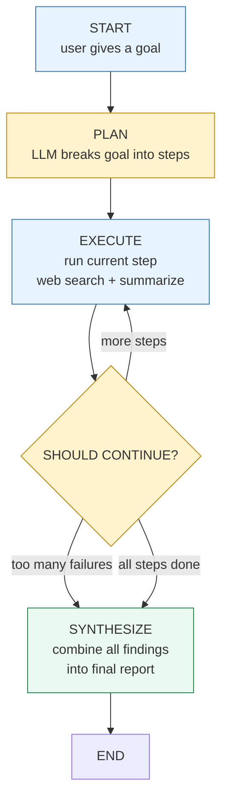
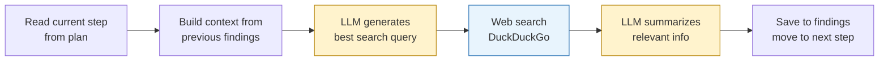
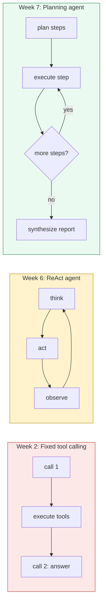

# Planning Agent with LangGraph

A multi-step research agent that **breaks complex goals into sub-tasks**, executes each with web search, recovers from failures, and synthesizes a final report — built with LangGraph.

Unlike a single-step agent that answers in one shot, this agent **plans ahead** — decomposing a goal into ordered steps, executing each while building on previous findings, and combining everything into a coherent answer.

---

## What it does

Give it a research goal. The agent plans, executes, and synthesizes:

```
What is your research goal? research the top 3 AI companies, 
compare their main products, and tell me which one is best for developers

  Plan created with 7 steps:
    1. search for top AI companies
    2. research first company's main products
    3. compare with second company's products
    4. research third company's products
    5. compare all three for developer features
    6. evaluate based on developer reviews
    7. determine which is best for developers

  Executing step 1: search for top AI companies
  Searching: 'top AI companies 2026'
  Step 1 succeeded

  Executing step 2: research first company's main products
  Searching: 'OpenAI main products 2026'
  Step 2 succeeded

  ... (5 more steps) ...

  Synthesizing final report...

==================================================
FINAL REPORT
==================================================
# Top AI Companies Report
...structured comparison with recommendations...
```

Seven steps, zero failures, structured report — from one sentence of input.

---

## The graph



Three nodes, one routing decision. The graph loops on the execute node until all steps are done or too many have failed.

---

## How each node works

### Plan node
Asks the LLM to decompose the goal into specific, ordered steps. Returns a JSON array of tasks:

```json
[
  {"id": 1, "task": "search for top AI companies", "status": "pending"},
  {"id": 2, "task": "research OpenAI products", "status": "pending"},
  {"id": 3, "task": "compare all companies", "status": "pending"}
]
```

The number of steps is **not hardcoded** — the LLM decides based on goal complexity. Simple goals get 1-2 steps, complex goals get 5-7.

### Execute node
For each step:



Key detail: each step receives **context from all previous findings**. Step 3 knows what steps 1 and 2 found — enabling the agent to build on its own research progressively.

### Should continue (routing)
Three decisions:

| Condition | Route to |
|---|---|
| More steps remaining | execute (loop back) |
| More than half the steps failed | synthesize (cut losses) |
| All steps done | synthesize |

### Synthesize node
Reads all findings, sends them to the LLM in one prompt, and asks for a structured report. Converts scattered research notes into a coherent answer.

```
BEFORE: 5 separate findings (raw research notes)
AFTER:  one structured report with sections and conclusions
```

---

## State management

All data flows through a shared TypedDict:

```python
class AgentState(TypedDict):
    goal:                str        # the user's original goal
    plan:                List[Dict] # list of steps
    current_step_index:  int        # which step we're on
    findings:            Dict       # results from each step
    failed_steps:        List[str]  # steps that failed
    final_report:        str        # the synthesized answer
```

Each node reads what it needs and writes its results back. Nodes don't call each other directly — they communicate only through state.

---

## Failure handling

The agent handles failures at two levels:

| Level | What happens | Recovery |
|---|---|---|
| Search fails | Web search returns no results or errors | Step marked as failed, "Data unavailable" saved, agent continues |
| Too many failures | More than half the steps failed | Agent stops executing and synthesizes with available data |

The agent produces a **partial result** rather than crashing — useful information is better than no information.

---

## The evolution from simple to multi-step



| Level | What it handles | Example |
|---|---|---|
| Week 2 | One question, model plans all tools upfront | "what is 5 + 3?" |
| Week 6 | One question, model decides tools step by step | "search the web and calculate" |
| Week 7 | Complex goals, planned sub-tasks, coordinated execution | "research 3 companies, compare, write report" |

---

## Tech stack

| Component | Choice |
|-----------|--------|
| Orchestration | LangGraph (StateGraph, conditional edges) |
| LLM | qwen2.5:7b (Ollama, local) |
| Web search | ddgs (DuckDuckGo, no API key) |
| State | TypedDict shared across nodes |

Runs **fully local and free**.

---

## Setup

```bash
ollama pull qwen2.5:7b
pip install langgraph langchain-ollama ddgs
python agent.py
```

---

## Project structure

```
.
├── agent.py         # the full planning agent
└── README.md
```

---

## Latency note

On a local 7B model running on CPU, a 7-step plan takes ~2-3 minutes because each step requires 3 LLM calls (query generation + web search + summarization). In production, this is solved by:

- Faster models (API like Claude Haiku: ~8 seconds total)
- Parallel step execution (independent steps run simultaneously)
- Fewer LLM calls per step (use task directly as search query)

The architecture is correct — latency is a deployment optimization, not a design problem.

---

## The progression

| Project | What it demonstrates |
|---------|---------------------|
| [Math Assistant](https://github.com/pratikb0501/Math-assistant-with-tool-calling) | Fixed tool calling — 2 LLM calls |
| [Bare-metal Agent](https://github.com/pratikb0501/Bare-metal-ReAct-agent) | ReAct loop — variable steps, one question at a time |
| [Agentic RAG](https://github.com/pratikb0501/Agentic-RAG) | Self-evaluating retrieval with LangGraph |
| **Planning Agent** (this repo) | Multi-step goal decomposition with LangGraph |

---

## What I learned

- How to decompose complex goals into executable sub-tasks using LLM planning
- The difference between plan-then-execute (rigid) and iterative planning (adaptive)
- LangGraph's StateGraph for building multi-node orchestration with conditional routing
- State management with TypedDict — nodes communicate only through shared state
- Progressive context building — each step receives findings from all previous steps
- Graceful degradation — synthesize partial results when steps fail rather than crashing
- The latency cost of multi-step agents and production strategies to mitigate it

Built as part of a self-directed AI engineering track — progressing from single-step agents to planned, multi-step orchestration.